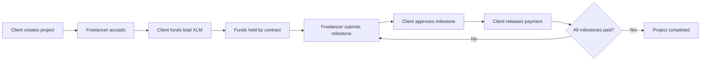
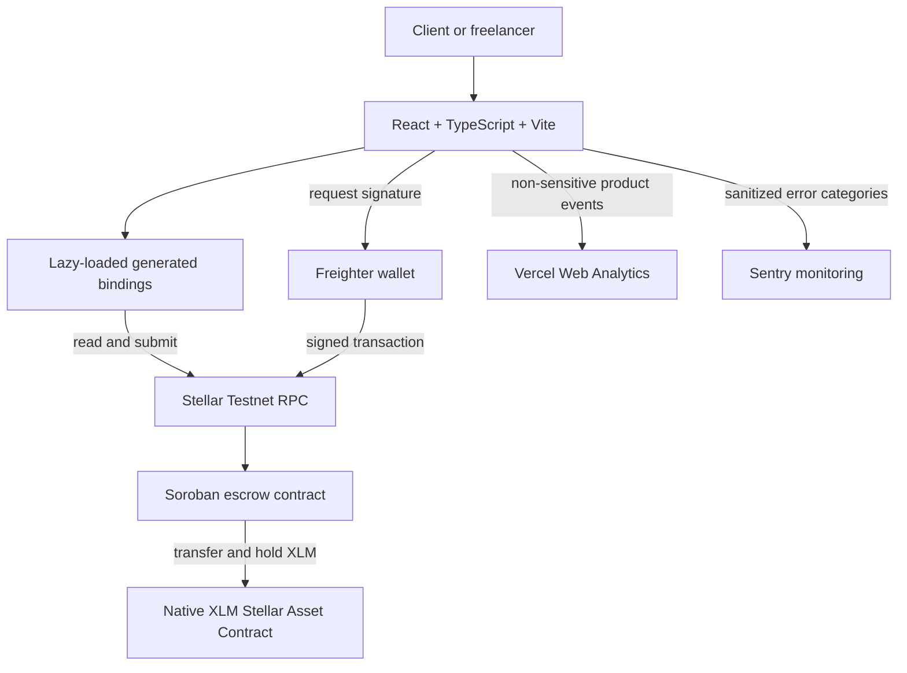
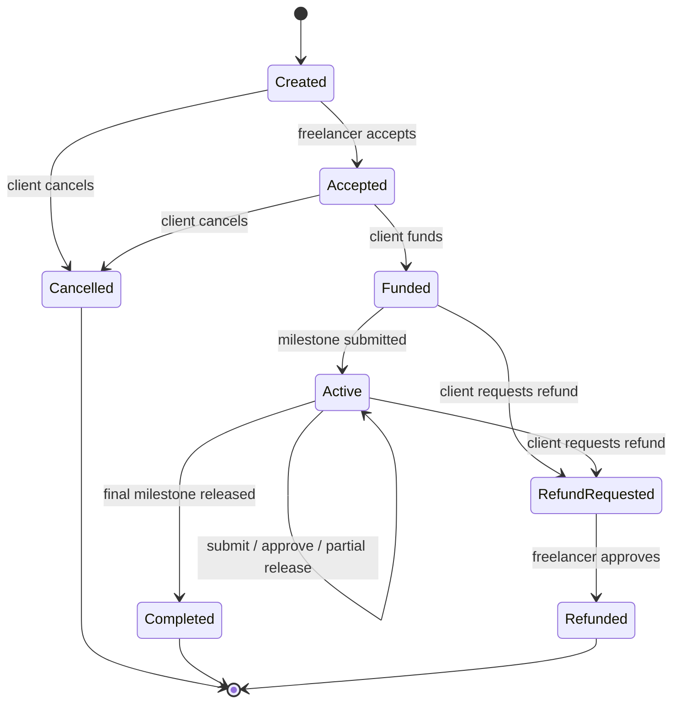
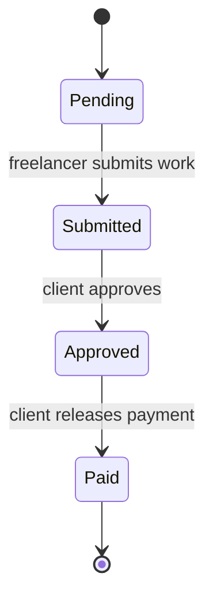

<div align="center">

# Stellar Milestone Escrow

**Milestone-based freelance payments secured by a Soroban escrow contract on Stellar Testnet.**

[](https://stellar-milestone-escrow.vercel.app/)
[](https://stellar.expert/explorer/testnet)
[](https://github.com/NaViN-TiWaRi-24/stellar-milestone-escrow/actions/workflows/ci.yml)
[](#testing-and-continuous-integration)
[](#testing-and-continuous-integration)

[Live Demo](https://stellar-milestone-escrow.vercel.app/) &middot;
[Repository](https://github.com/NaViN-TiWaRi-24/stellar-milestone-escrow) &middot;
[Stellar Contract](https://lab.stellar.org/r/testnet/contract/CCQGR5ASUDD5BBOWPVU5TNXUH675HSRFHXGWNFT4CPXVQMFZFKX5V2ET) &middot;
[Security Review](SECURITY.md) &middot;
[Verified Transactions](#testnet-deployment-and-verified-transactions)

</div>

> This application and contract run on Stellar Testnet. Testnet assets have no
> real-world value.

## Table of contents

- [Project overview](#project-overview)
- [Problem and solution](#problem-and-solution)
- [Key features](#key-features)
- [Escrow workflow](#escrow-workflow)
- [Technical architecture](#technical-architecture)
- [User workflows](#user-workflows)
- [Smart-contract interface](#smart-contract-interface)
- [State lifecycles](#state-lifecycles)
- [Token accounting](#token-accounting)
- [Security](#security)
- [Testing and continuous integration](#testing-and-continuous-integration)
- [Testnet deployment and verified transactions](#testnet-deployment-and-verified-transactions)
- [Production frontend deployment](#production-frontend-deployment)
- [User testing and feedback](#user-testing-and-feedback)
- [Known limitations](#known-limitations)
- [Roadmap](#roadmap)
- [Repository structure](#repository-structure)
- [Author and acknowledgements](#author-and-acknowledgements)

## Project overview

Stellar Milestone Escrow is a responsive React application backed by a Rust
Soroban contract. A client creates a project with one or more milestones,
selects a freelancer, and funds the agreed total in Testnet XLM. The freelancer
submits work milestone by milestone, while the client controls approval and
payment release.

The application connects through Freighter and reads real contract state for
the dashboard and project details. Transactions are signed in the wallet; the
application never requests a private key or seed phrase.

| Deployment detail | Value |
| --- | --- |
| Network | Stellar Testnet |
| Contract ID | `CCQGR5ASUDD5BBOWPVU5TNXUH675HSRFHXGWNFT4CPXVQMFZFKX5V2ET` |
| Optimized contract WASM | 15,651 bytes |
| Verified lifecycle | Create → Accept → Fund → Submit → Approve → Release |
| Verified final state | Project `Completed`; milestone `Paid` |
| Monitoring | Vercel Web Analytics and privacy-safe Sentry monitoring |

## Problem and solution

### Problem

Freelance work often requires one party to take payment risk: a freelancer may
deliver before being paid, while a client may be asked to pay before work is
accepted. Cross-border coordination can make status, evidence, and payment
expectations harder to follow.

### Solution

The contract makes the agreed workflow explicit. Funds move into escrow only
after the selected freelancer accepts the project. Each milestone must then be
submitted, approved, and released through separate authorized actions. Contract
state supplies a shared, public record of progress without giving either party
unilateral access to the other role's actions.

## Key features

- Real Freighter wallet connection and signed Soroban transactions
- Multi-milestone projects with future deadlines and work references
- Native Testnet XLM funding through the Stellar Asset Contract
- Role-aware actions for clients and freelancers
- Exact decimal-to-stroop conversion using strings and `BigInt`
- On-chain project and milestone status tracking
- Cancellation before funding and a two-party refund flow after funding
- Responsive dashboard and accessible transaction modals
- Lazy-loaded generated Stellar contract bindings
- Persistent and instance storage TTL renewal
- Vercel Web Analytics and privacy-safe Sentry error monitoring
- Automated Rust and frontend verification in GitHub Actions

## Escrow workflow



The complete Testnet workflow has been exercised successfully. Its final
project state was `Completed`, and the released milestone state was `Paid`.

## Technical architecture



Read-only dashboard queries do not require wallet authorization or transaction
signing. State-changing calls are prepared through the generated bindings and
signed by Freighter.

## User workflows

### Client workflow

1. Connect Freighter on Stellar Testnet.
2. Create a project with a freelancer G-address, title, and milestones.
3. Wait for the selected freelancer to accept.
4. Fund the exact project total in Testnet XLM.
5. Review submitted work references.
6. Approve a submitted milestone.
7. Release its payment from escrow.
8. Repeat until every milestone is paid and the project is completed.

Before funding, the client may cancel a project. After funding, the client may
request a refund of unreleased escrow; the freelancer must approve that refund.

### Freelancer workflow

1. Connect the Freighter account selected by the client.
2. Review and accept the project.
3. After funding, submit a non-empty work reference for a pending milestone.
4. Wait for client approval and payment release.
5. Repeat for the remaining milestones.
6. Review and, when appropriate, approve a client refund request.

## Smart-contract interface

| Function | Authorized role | Purpose |
| --- | --- | --- |
| `create_project` | Client | Creates a project and milestone schedule |
| `get_project` | Public read | Returns one project by ID |
| `get_user_projects` | Public read | Returns project IDs indexed to an address |
| `accept_project` | Selected freelancer | Accepts a newly created project |
| `fund_project` | Project client | Transfers the exact project total into escrow |
| `submit_milestone` | Project freelancer | Adds a work reference and submits a pending milestone |
| `approve_milestone` | Project client | Approves a submitted milestone |
| `release_milestone_payment` | Project client | Pays one approved milestone to the freelancer |
| `cancel_project` | Project client | Cancels a project before funding |
| `request_refund` | Project client | Requests return of unreleased escrow |
| `approve_refund` | Project freelancer | Approves and transfers the remaining escrow to the client |

Public function signatures are represented by generated TypeScript bindings in
`frontend/packages/milestone-escrow`.

## State lifecycles

### Project states



### Milestone states



Terminal projects expose no further transaction actions in the frontend.

## Token accounting

Stellar represents XLM at seven decimal places:

```text
1 XLM = 10,000,000 stroops
```

The frontend never uses floating-point arithmetic for token amounts. It
validates a decimal string with at most seven fractional digits and converts it
to stroops with string and `BigInt` operations. For example:

```text
12.3456789 XLM = 123,456,789 stroops
```

The project total must equal the exact sum of its milestone amounts. The
contract uses signed 128-bit integers and checked arithmetic. Funding transfers
the project total to the contract once. A release transfers exactly the
approved milestone amount, while an approved refund transfers:

```text
refund = escrowed amount - already released amount
```

Status checks and accounting guards prevent double funding, double payment, and
refunds when no escrow remains.

## Security

The repository includes an [internal security review](SECURITY.md). It is not a
professional or third-party audit and must not be represented as one.

| Control | Implementation |
| --- | --- |
| Authentication | State-changing functions call Soroban `require_auth` for the acting address |
| Role authorization | Stored client and freelancer addresses are checked before role-specific actions |
| State-transition safety | Project and milestone actions require the expected current state |
| Double-funding protection | Funding requires `Accepted` status and zero existing escrow |
| Double-payment protection | Only an `Approved` milestone can be paid; `Paid` milestones cannot be released again |
| Refund protection | Only the client requests a funded refund; only the selected freelancer approves it |
| Exact arithmetic | Positive amounts, exact milestone totals, checked contract arithmetic, and frontend `BigInt` conversion |
| Storage lifetime | Project, participant indexes, instance data, contract code, and `NextProjectId` receive TTL renewal |

The TTL policy renews entries when fewer than **30 days** remain and targets an
approximately **180-day** lifetime. Normal reads intentionally do not create
transactions. Long-inactive archived entries may still require Stellar state
restoration or a maintenance transaction.

Analytics contain fixed event names and non-sensitive state only. Wallet
addresses, transaction hashes, project data, amounts, work references, form
values, and error stacks are excluded. Sentry is optional and receives only
sanitized action, Testnet, and broad error-category information.

## Testing and continuous integration

| Suite | Coverage | Result |
| --- | --- | --- |
| Rust contract tests | Authorization roles, transitions, accounting, refunds, payments, indexes, and TTL renewal | 17 passing |
| Frontend tests | Exact amount conversion, status rendering, role actions, error handling, analytics, and monitoring | 22 passing |
| GitHub Actions | Rust format/tests plus frontend binding build, lint, tests, and production build | Passing |
| Contract build | Optimized Soroban WASM | 15,651 bytes |

Run the local verification suite:

```bash
cargo fmt --check
cargo test
stellar contract build
npm run lint --prefix frontend
npm run test --prefix frontend
npm run build --prefix frontend
git diff --check
```

Tests mock wallet, RPC, analytics, monitoring, and contract calls; they do not
send live transactions.

## Testnet deployment and verified transactions

| Item | Link |
| --- | --- |
| Contract | [Open in Stellar Lab](https://lab.stellar.org/r/testnet/contract/CCQGR5ASUDD5BBOWPVU5TNXUH675HSRFHXGWNFT4CPXVQMFZFKX5V2ET) |
| WASM upload | [`7d8d88b5...5421f3`](https://stellar.expert/explorer/testnet/tx/7d8d88b54095c1762ebcf851e6a785ab5e6f930fd6a237cc219fe4e35e5421f3) |
| Contract deployment | [`7963edad...c5419`](https://stellar.expert/explorer/testnet/tx/7963edad073d903f96a330e8a069191915b2cc1064dc07d3b64a14235bbc5419) |
| Project creation | [`c8ad968f...f14be4`](https://stellar.expert/explorer/testnet/tx/c8ad968f9ba1cb098341feb625a98762bc8fc22fb57c557c65459cdb36f14be4) |
| Milestone submission | [`84999f5b...065e76`](https://stellar.expert/explorer/testnet/tx/84999f5b4b3466846df9ecab005fa1cc04b1c0a82977a5b70f035ca6f0065e76) |

These links are deployment and workflow evidence, not a guarantee of contract
security or future availability.

## Production frontend deployment

The Vite application is deployed from `frontend/`. Its normal build lifecycle
first compiles the local generated bindings and then runs TypeScript and Vite:

```text
npm run build
  └─ prebuild
     └─ build:bindings
  └─ build:app
     └─ tsc -b && vite build
```

### Vercel settings

| Setting | Value |
| --- | --- |
| Root Directory | `frontend` |
| Install Command | `npm ci` |
| Build Command | `npm run build` |
| Output Directory | `dist` |

Configure these variables in the Vercel project rather than committing secrets:

```env
VITE_STELLAR_RPC_URL=https://soroban-testnet.stellar.org
VITE_STELLAR_NETWORK_PASSPHRASE=Test SDF Network ; September 2015
VITE_ESCROW_CONTRACT_ID=CCQGR5ASUDD5BBOWPVU5TNXUH675HSRFHXGWNFT4CPXVQMFZFKX5V2ET
VITE_XLM_SAC_ID=CDLZFC3SYJYDZT7K67VZ75HPJVIEUVNIXF47ZG2FB2RMQQVU2HHGCYSC
VITE_STELLAR_EXPLORER_URL=https://stellar.expert/explorer/testnet
VITE_SENTRY_DSN=
VITE_SENTRY_ENABLE_DEV=false
```

`VITE_SENTRY_DSN` is optional; the application operates normally without it.
Enable Web Analytics separately in the Vercel project dashboard. For Sentry,
create a browser project, store its DSN in Vercel, and review the Sentry
project's access and retention settings.

## User testing and feedback

Three people participated in real-user testing: two freelancers and one general
visitor. All three explored the dashboard and project details; two also tested
wallet connection and the main escrow lifecycle.

| Result | Outcome |
| --- | --- |
| Usability rating | All testers rated it 5/5 |
| Workflow understanding | 100% understood the escrow purpose and workflow |
| Recommendation | 100% would use or recommend the application |
| Errors or confusion | None reported |

Positive feedback covered understandable wallet and status information,
milestones, payment amounts, action buttons, the complete escrow workflow, the
simple dashboard, and mobile responsiveness. No critical improvement was
requested.

### Improvements made during MVP testing

- Responsive desktop and mobile interface
- Clear wallet and transaction states
- Exact `BigInt` XLM/stroop conversion
- Lazy-loaded generated Stellar bindings
- Accessible modals and error boundary
- Privacy-safe analytics and Sentry monitoring
- Automated frontend and contract tests with GitHub Actions CI

## Known limitations

- The application and deployed contract use Stellar Testnet only.
- The internal security review is not an independent professional audit.
- Refunds require freelancer approval; there is no arbitrator, timeout escape,
  administrator recovery, pause, or emergency withdrawal path.
- The contract accepts an asset address supplied by a direct caller; the
  frontend constrains project creation to the configured Testnet XLM contract.
- Project and milestone titles, work references, milestone counts, and
  per-address project indexes do not have application-level size limits.
- Deadlines are validated as future timestamps at creation but are not enforced
  as automatic on-chain expiry rules.
- Long-inactive persistent entries can be archived despite TTL renewal and may
  need state restoration or maintenance.
- Contract data and work references are public blockchain data and should not
  contain secrets or personal information.

## Roadmap

### Completed MVP

- [x] Soroban milestone escrow contract
- [x] Freighter wallet integration
- [x] Real Testnet reads and signed transactions
- [x] Complete create-to-release lifecycle
- [x] Cancellation and cooperative refund flow
- [x] Responsive production frontend on Vercel
- [x] Exact XLM accounting and generated typed bindings
- [x] Storage TTL renewal and internal security review
- [x] Automated Rust/frontend tests and GitHub Actions CI
- [x] Privacy-safe analytics and error monitoring
- [x] Real-user testing

### Future work

- [ ] Define timeout, dispute-resolution, and recovery policies
- [ ] Add bounded or paginated project indexes and input limits
- [ ] Restrict or clearly verify supported asset contracts on-chain
- [ ] Add explicit negative authorization-tree tests
- [ ] Establish an operational state-restoration process
- [ ] Add deployment security headers and dependency audit automation
- [ ] Obtain an independent professional security audit before real-value use

## Repository structure

```text
stellar-milestone-escrow/
├── .github/
│   └── workflows/
│       └── ci.yml
├── contracts/
│   └── milestone_escrow/
│       ├── src/
│       │   ├── lib.rs
│       │   └── test.rs
│       └── Cargo.toml
├── frontend/
│   ├── packages/
│   │   └── milestone-escrow/
│   ├── src/
│   │   ├── components/
│   │   └── lib/
│   ├── .env.example
│   └── package.json
├── Cargo.toml
├── SECURITY.md
└── README.md
```

## Author and acknowledgements

Created by [NaViN TiWaRi](https://github.com/NaViN-TiWaRi-24) for the Stellar
Journey to Mastery Level 4 Green Belt project.

Acknowledgements:

- [Stellar](https://stellar.org/) and Soroban for the network and smart-contract
  platform
- [Freighter](https://www.freighter.app/) for wallet connectivity
- [Vercel](https://vercel.com/) for frontend hosting and Web Analytics
- [Sentry](https://sentry.io/) for optional runtime error monitoring
- The three MVP testers whose feedback validated usability and workflow clarity
